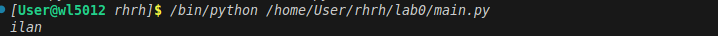

# ОТЧЕТ по лабораторной работе 0
## *Задание*
1. Создать репозиторий для дисциплины на github
2. Клонирование репозитория себе на ПК
3. Написать свою первую программу
4. Запустить её
5. Сделать commit и push
6. Написать отчёт в README
7. Сделать для себя шпаргалку в отчёте по работе с git
## *Написание своей первой программы*
```python
print('ilan') #выводит на экран ilan 
``` 
## *Результат*

## *Список используемых материалов:*
- [справка по markdawn](https://doka.guide/tools/markdown/)
- [пример отчёта](https://github.com/still-coding/report_demo)
## *Шпаргалка по работе с git*
``` python
git init              # Инициализирует репозиторий (скрытая папка .git)
git clone <url>       # Клонирование удалённого репозитория (локальная копия)
git status            # Проверка состояния рабочего каталога и индекса
git add <file>        # Добавляет файлы в индекс
git commit -m "текст" # Фиксация изменений с комментарием в локальном репозитории
git push              # Отправление изменений из локального репозитория на GitHub
git pull              # Получение изменений с удалённого репозитория на локальный
```
