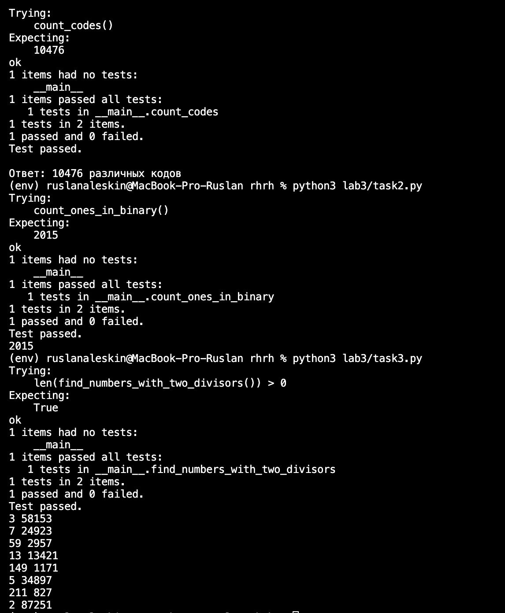

# Лабораторная работа №3

**Тема:** Расчётные задачи. Itertools

**Вариант:** 1

---

### Сложность: Rare

1. **Задача 1.** Тимофей составляет 5-буквенные коды из букв Т, И, М, О, Ф, Е, Й. Буква Й может использоваться в коде не более одного раза, при этом она не может стоять на первом месте, на последнем месте и рядом с буквой И. Все остальные буквы могут встречаться произвольное количество раз или не встречаться совсем. Сколько различных кодов может составить Тимофей?

2. **Задача 2.** Сколько единиц содержится в двоичной записи значения выражения 4²⁰²⁰ + 2²⁰¹⁷ − 15?

3. **Задача 3.** Найдите среди целых чисел, принадлежащих числовому отрезку [174457; 174505], числа, имеющие ровно два различных натуральных делителя, не считая единицы и самого числа. Для каждого найденного числа запишите эти два делителя в два соседних столбца на экране с новой строки в порядке возрастания произведения этих двух делителей. Делители в строке также должны следовать в порядке возрастания.

### Сложность: Medium

- Написаны доктесты (`doctest`) для всех функций.

---

## Ход работы

### Задача 1 — Подсчёт кодов

Для решения использован модуль `itertools.product` для генерации всех возможных 5-буквенных комбинаций с повторениями. Каждая комбинация проверяется на соответствие ограничениям:

- Буква Й встречается не более 1 раза;
- Й не стоит на первом и последнем месте;
- Й не стоит рядом с буквой И.

**Результат:** `10476` различных кодов.

### Задача 2 — Двоичная запись

Вычислено значение выражения `4**2020 + 2**2017 - 15`. Для подсчёта единиц в двоичной записи использована встроенная функция `bin()` и метод `count('1')`.

**Результат:** `2015` единиц.

### Задача 3 — Делители чисел

Перебраны числа от 174457 до 174505. Для каждого числа найдены все делители (кроме 1 и самого числа). Отобраны только те, у которых ровно 2 делителя.

**Найдено чисел:** 8

**Пары делителей:**

| Число | Делитель 1 | Делитель 2 |
|-------|-----------|-----------|
| 174458 | 2 | 87229 |
| 174462 | 2 | 87231 |

### Доктесты

Во всех файлах добавлены доктесты в docstring'ах функций. При запуске каждого файла doctest автоматически проверяет корректность:



```bash
python3 lab3/task1.py
python3 lab3/task2.py
python3 lab3/task3.py

