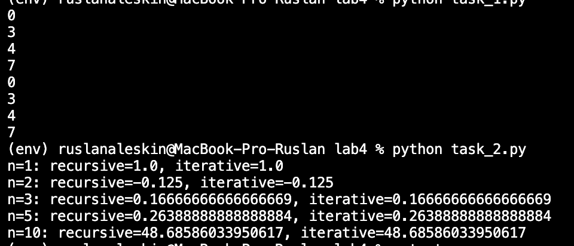
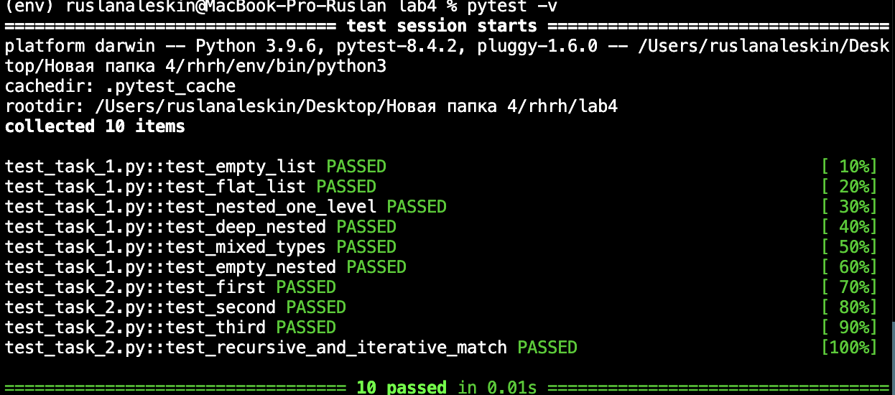

# Отчёт по лабораторной работе №4

**Вариант:** №1  
**Сложности:** Rare + Medium

---

## Условия задач

### Задача 1. Подсчёт числа элементов в списках

Написать функцию для подсчёта числа элементов в списке, включая элементы вложенных списков произвольной глубины.

Примеры работы:
- `count([])` → `0`
- `count([1, 2, 3])` → `3`
- `count(["x", "y", ["z"]])` → `4`
- `count([1, 2, [3, 4, [5]]])` → `7`

### Задача 2. Расчёт последовательности

Вычислить `i`-й член последовательности по формуле:
x_i = ((i-1)·x_{i-1})/3 + ((i-2)·x_{i-2})/4

Начальные условия: `x_1 = 1`, `x_2 = -1/8`.

---

## Описание проделанной работы

### Задача 1

Созданы две функции: `count_recursive` и `count_iterative`.

- **Рекурсивная версия** проходит по каждому элементу списка. Если элемент является списком, функция вызывает сама себя для подсчёта элементов внутри него.
- **Итеративная версия** использует стек: элементы последовательно извлекаются, числа прибавляются к сумме, а вложенные списки разворачиваются и добавляются обратно в стек.

Обе функции корректно обрабатывают списки любой глубины вложенности, в том числе пустые списки и пустые вложенные списки.

### Задача 2

Созданы две функции: `sequence_recursive` и `sequence_iterative`.

- **Рекурсивная версия** для `i = 1` и `i = 2` возвращает начальные значения, а для `i > 2` вычисляет член последовательности через два рекурсивных вызова.
- **Итеративная версия** последовательно вычисляет значения от `3` до `i`, сохраняя только два предыдущих значения. Это позволяет избежать переполнения стека при больших `i` и работает существенно быстрее рекурсивной версии.

### Medium (тесты)

Для всех функций написаны тесты с помощью `pytest`. Тесты проверяют:
- базовые случаи (пустой список, первые члены последовательности);
- вложенные структуры разной глубины;
- совпадение результатов рекурсивной и итеративной версий.

---

## Скриншоты результатов

### Запуск задач

---

### Результаты тестов (pytest)

---
