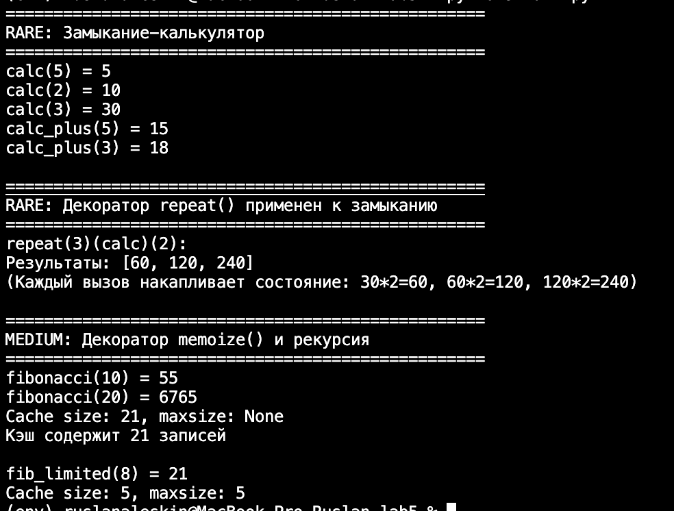

# Лабораторная работа №5: Замыкания и декораторы в Python

## Условие задачи

### Вариант 1 — Rare

1. **Замыкание-калькулятор**: создать функцию `make_calc(operator, initial)`, возвращающую замыкание, которое накапливает результат арифметической операции (`+`, `-`, `*`, `/`).
2. **Декоратор многократного запуска**: создать декоратор `repeat(times)`, который запускает функцию указанное число раз с одними и теми же аргументами и возвращает список результатов.
3. **Применить декоратор к замыканию**.

### Medium

Создать декоратор `memoize` с опциональным параметром `maxsize` для мемоизации функций. Декоратор должен корректно работать с рекурсивными функциями (проверить на числах Фибоначчи).

## Описание проделанной работы

### 1. Структура программы

| Компонент | Назначение |
|-----------|------------|
| `make_calc(operator, initial)` | Внешняя функция замыкания, создающая калькулятор с накоплением |
| `calc(value)` | Внутренняя функция замыкания, применяющая операцию и обновляющая `result` через `nonlocal` |
| `repeat(times)` | Декоратор с параметром, запускающий функцию `times` раз, возвращает список |
| `memoize(maxsize)` | Декоратор с опциональным параметром, кэширующий результаты вызовов |

### 2. Реализация замыкания

- Переменная `result` хранится в объемлющей области видимости `make_calc`.
- Внутренняя функция `calc` использует `nonlocal result` для изменения значения.
- Поддерживаются 4 операции; для деления добавлена проверка на ноль.

### 3. Реализация декоратора `repeat`

- Используется тройная вложенность: `repeat(times)` → `decorator(func)` → `wrapper(*args, **kwargs)`.
- Применён `functools.wraps` для сохранения имени и документации функции.
- Возвращается список результатов последовательных вызовов.

### 4. Применение декоратора к замыканию

- Замыкание `calc` создано динамически, поэтому декоратор применяется вручную: `repeat(3)(calc)`.
- Поскольку замыкание хранит состояние, каждый повторный вызов видит накопленный результат.

### 5. Реализация декоратора `memoize` (Medium)

- Поддерживает два синтаксиса: `@memoize` (без скобок) и `@memoize(maxsize=N)`.
- Для ограничения кэша реализована простая стратегия удаления самого старого элемента.
- Рекурсивные вызовы идут через обёртку `wrapper`, поэтому повторные вычисления берутся из кэша — сложность Фибоначчи падает с экспоненциальной до линейной.

## Скриншоты результатов

