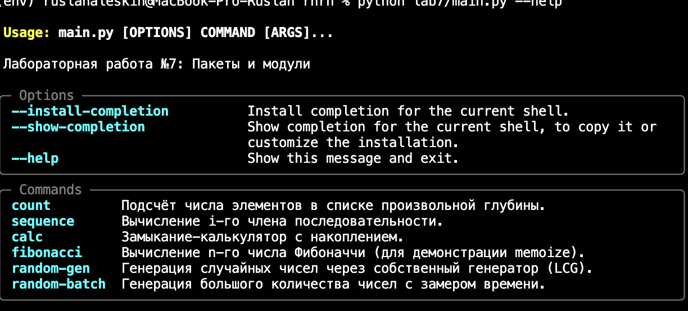
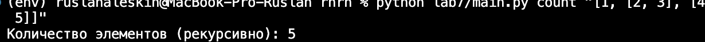
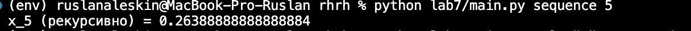
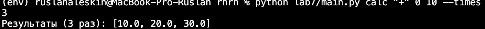
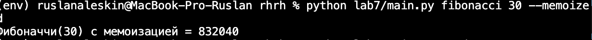
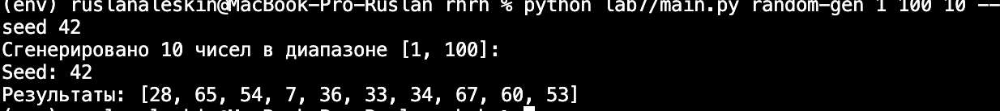
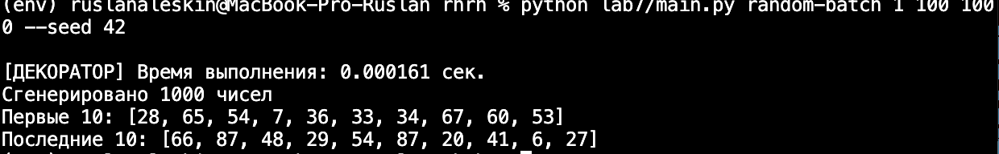
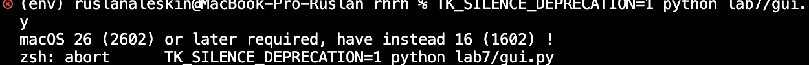

# Лабораторная работа №7: Пакеты и модули

**Вариант:** №1  
**Сложности:** Rare + Medium

---

## Условия задач

### Rare
1. Создать пакет `lab7_package`, содержащий 3 модуля на основе лабораторных работ №4, №5, №6.
2. Написать запускающий модуль `main.py` на основе **Typer**, который позволит выбирать и настраивать параметры запуска логики из пакета.
3. Оформить отчёт в `README.md`.

### Medium
Реализовать GUI-приложение на одном из актуальных фреймворков (`tkinter`).

---

## Содержание модулей

| Модуль | Источник | Функциональность |
|--------|----------|------------------|
| `task4.py` | Лабораторная работа №4 | Подсчёт элементов в списке произвольной глубины (рекурсивно и итеративно). Вычисление рекуррентной последовательности |
| `task5.py` | Лабораторная работа №5 | Замыкание-калькулятор, декоратор многократного запуска `repeat`, декоратор мемоизации `memoize`, декоратор замера времени |
| `task6.py` | Лабораторная работа №6 | Генератор случайных чисел (LCG, без модуля `random`). Декоратор замера времени |

---

## Описание проделанной работы

### 1. Модуль task4.py (рекурсия)

- `count_recursive(lst)` — рекурсивно обходит вложенные списки и считает количество элементов.
- `count_iterative(lst)` — реализует ту же логику через явный стек.
- `sequence_recursive(i)` — вычисляет `i`-й член последовательности по формуле:  
  `x_i = ((i-1)·x_{i-1})/3 + ((i-2)·x_{i-2})/4`  
  Начальные условия: `x_1 = 1`, `x_2 = -1/8`.
- `sequence_iterative(i)` — итеративный вариант, хранит только 2 предыдущих значения.

### 2. Модуль task5.py (замыкания и декораторы)

- `make_calc(operator, initial)` — замыкание, создающее калькулятор с накоплением. Поддерживает `+`, `-`, `*`, `/`.
- `repeat(times)` — декоратор с параметром, запускает функцию `times` раз и возвращает список результатов.
- `memoize(maxsize)` — декоратор мемоизации с опциональным ограничением кэша. Работает с рекурсивными функциями (проверено на Фибоначчи).
- `timer_decorator` — декоратор для замера времени выполнения функции.

### 3. Модуль task6.py (генераторы)

- `bounded_random(min_val, max_val, seed)` — генератор случайных чисел на основе линейного конгруэнтного метода (LCG). Не использует модуль `random`.
- `timer_decorator` — декоратор замера времени (также используется в `task6.py` для демонстрации).

### 4. Запускающий модуль main.py (Typer)

Реализованы команды CLI:
- `count` — подсчёт элементов в списке.
- `sequence` — вычисление рекуррентной последовательности.
- `calc` — замыкание-калькулятор с накоплением.
- `fibonacci` — вычисление чисел Фибоначчи (для демонстрации `memoize`).
- `random-gen` — генерация случайных чисел через LCG.
- `random-batch` — генерация большого количества чисел с замером времени.

### 5. GUI приложение gui.py (tkinter)

Реализовано приложение с 4 вкладками:
- **Подсчёт элементов** — ввод списка, выбор метода (рекурсивный/итеративный), вывод результата.
- **Последовательность** — ввод `i`, выбор метода, вывод `x_i`.
- **Калькулятор** — выбор оператора, начального значения, значения для операции и количества повторов.
- **Генератор** — задание диапазона, количества чисел, seed; генерация через LCG.

---

## Скриншоты результатов

### Typer CLI — список команд

```bash
$ python lab7/main.py --help
```

### Команда count
```bash
$ python lab7/main.py count "[1, [2, 3], [4, 5]]"
Количество элементов (рекурсивно): 5
```

### Команда sequence
```bash
$ python lab7/main.py sequence 5
x_5 (рекурсивно) = 0.26388888888888884
```

### Команда calc
```bash
$ python lab7/main.py calc "+" 0 10 --times 3
Результаты (3 раз): [10.0, 20.0, 30.0]
```

### Команда fibonacci
```bash
$ python lab7/main.py fibonacci 30 --memoized
Фибоначчи(30) с мемоизацией = 832040
```

### Команда random-gen
```bash
$ python lab7/main.py random-gen 1 100 10 --seed 42
```

### Команда random-batch
```bash
$ python lab7/main.py random-batch 1 100 1000 --seed 42
```

### Примечание по GUI (Medium)
GUI-приложение реализовано в gui.py с использованием tkinter.
При запуске на macOS (Python 3.9) возникает системная ошибка совместимости tkinter
Код приложения содержит 4 вкладки: Подсчёт элементов, Последовательность, Калькулятор, Генератор случайных чисел.
Проблема связана с несовместимостью встроенного tkinter в Python 3.9 и версии macOS, а не с кодом программы.

