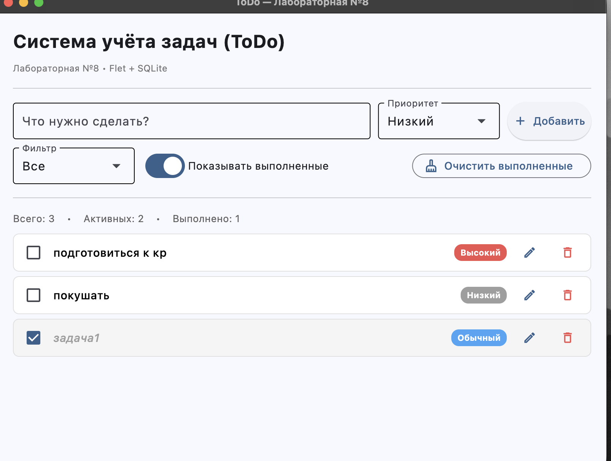

# Лабораторная работа №8 — Итоговый проект

**Тема:** GUI-приложение по варианту №1 — *«Система учёта задач (ToDo)»*
**Вариант:** №1
**Сложности:** Rare + Medium

---

## Название приложения

**TodoFlet** — настольное приложение для ведения списка дел с приоритетами,
фильтрами и сохранением задач в локальной БД SQLite.

## Описание

Приложение реализует базовый сценарий менеджера задач:

- добавление задачи с приоритетом (высокий / обычный / низкий);
- отметка о выполнении (чекбокс — переключает статус);
- редактирование заголовка и приоритета во всплывающем диалоге;
- удаление задачи;
- фильтрация по приоритету;
- переключатель «показывать выполненные»;
- кнопка массового удаления всех выполненных задач;
- строка статистики (всего / активных / выполнено).

Все задачи сохраняются в файл `todo.db` рядом с программой — данные не теряются
между запусками.

## Стек

| Компонент | Технология | Зачем |
|-----------|-----------|-------|
| GUI       | **Flet 0.28** | Современный фреймворк, **работает на macOS из коробки** в отличие от tkinter под Python 3.9 |
| Хранение  | **SQLite** (модуль `sqlite3` из стандартной библиотеки) | Файловая БД, не требует установки сервера |
| CLI-обвязка для тестов | стандартный `python` | — |

> **Про tkinter и macOS.** Встроенный `tkinter` в Python 3.9 на macOS падает с
> ошибкой совместимости (это видно ещё в lab7). В качестве выхода выбран Flet —
> он использует собственный рендер на основе Flutter и не зависит от системного
> Tcl/Tk.

---

## Структура

```
lab8/
├── main.py          # Flet GUI — точка входа
├── db.py            # SQLite-слой (CRUD для задач)
├── requirements.txt # зависимости
├── todo.db          # создаётся автоматически при первом запуске
└── README.md
```

---

## Инструкции по запуску

Работа ведётся в виртуальном окружении проекта (`env/` в корне репозитория).

```bash
# 1. Активировать venv
source env/bin/activate

# 2. Установить зависимости (один раз)
pip install -r lab8/requirements.txt

# 3. Запустить приложение
python lab8/main.py
```

При первом запуске рядом с `main.py` создастся файл `todo.db` — это и есть
локальная база.

---

## Краткая справка

| Действие | Как сделать |
|----------|-------------|
| Добавить задачу | Ввести текст в поле сверху, выбрать приоритет, нажать **«Добавить»** (или Enter) |
| Отметить выполненной | Поставить галочку слева от задачи |
| Редактировать | Кнопка-карандаш справа от задачи |
| Удалить одну | Кнопка-корзина справа от задачи |
| Удалить все выполненные | Кнопка **«Очистить выполненные»** справа |
| Фильтр по приоритету | Выпадающий список «Фильтр» |
| Скрыть выполненные | Переключатель «Показывать выполненные» |

Приоритеты подсвечиваются цветом плашки:
- 🔴 **Высокий** — красный
- 🔵 **Обычный** — синий
- ⚪ **Низкий** — серый

---

## Описание модуля `db.py`

| Функция | Назначение |
|---------|------------|
| `init_db()` | Создаёт таблицу `tasks`, если её ещё нет |
| `add_task(title, priority)` | Добавляет задачу, возвращает её `id` |
| `list_tasks(show_done, priority)` | Возвращает список задач с фильтрами |
| `toggle_task(id)` | Переключает статус выполнения |
| `update_task(id, title, priority)` | Изменяет поля задачи |
| `delete_task(id)` | Удаляет задачу |
| `clear_done()` | Удаляет все выполненные, возвращает их число |
| `stats()` | Возвращает `{total, active, done}` |

Схема таблицы:

```sql
CREATE TABLE tasks (
    id          INTEGER PRIMARY KEY AUTOINCREMENT,
    title       TEXT    NOT NULL,
    priority    TEXT    NOT NULL DEFAULT 'normal',
    done        INTEGER NOT NULL DEFAULT 0,
    created_at  TEXT    NOT NULL,
    done_at     TEXT
);
```

---

## Пример выполнения



